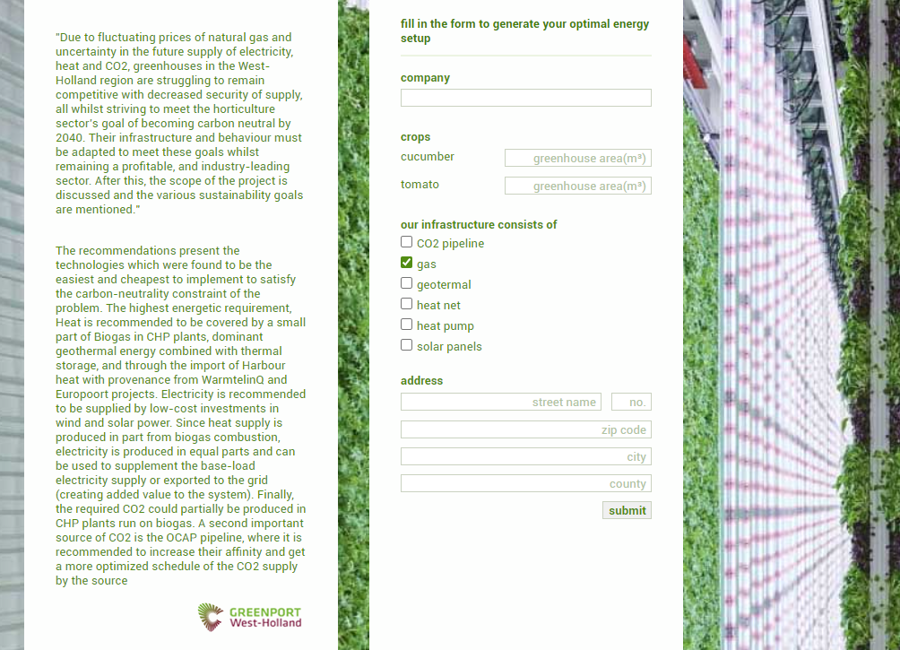

# Hackathon For Good - Finalist

## The Challenge
Greenhouse growers are having a difficulty deciding what to do individually regarding implementing and investing in energy and heating solutions. Switching over to new tech or energy/heating sources, can pose difficulties and changes or risks to the yield. Taking on a serious investment like this can be daunting, hence why some of the growers are struggling to keep their business healthy and prepared for the shifts in the national and work economy. Some possible heat alternatives to the standard natural gas CHP are: waste heat, geothermal, hydrogen, heat pumps.

How ​can ​we ​help ​greenhouse growers to make educated and sustainable long-term choices ​by using a decision making/matchmaking tool connecting them to local peers and initiatives ​when managing heating/energy/cooling demands and excess per season ​instead ​of tackling the problem alone or going to a consultant?

## Result
The jury selected us as the winner of our challenge! In the Finale we had to compete against against the winners of the 4 other challenges. After a long discussion, the jury eventually choose "The North Sea Sharks" with their solution OPEN STAD as the winner of the 5th edition of the Hackathon for Good! Congratulations to: Alexey Budiak, Alexey Udalov, Sergey Kim & Uladzimir Mihura. 

## Our solution
### Short Pitch
Greennet will help greenhouse growers transition to a more sustainable way of managing their heating, energy, and cooling demands. Based on input from the client, our model will compute the optimal energy solution considering the surrounding energy providers as well as distributing surplus heat. This will arm the client with a clear understanding of the costs and benefits of switching to a more sustainable energy infrastructure and the ability to connect to other growers and companies with compatible needs.

### Our plan
We’ll create a website where companies can fill in data on:
- the size and/or volume of the greenhouses
- the crops they are growing
- their current energy-setup
- cost of the current setup
- the location of the company (address or gps)

Our model will compute (taking in account different energy needs in different seasons):
- the maximum estimated output of the selected crops in their greenhouse
- how much energy the greenhouse will need based on
- energy needed for heating, cooling and lighting (optimal growing temperature of crops)
- energy coming in from sun (greenhouse effect) based on weather data
- energy loss (insulation value combined with outside temperature)
- check if heat pump is allowed/cost effective using https://wkotool.nl/
- it will check if our database has info on houses/companies close to the location that are connected to a heating network using https://www.warmteatlas.nl/
- how many solar panels could be placed (extra) on top of the roof (based on images from google maps)

It will output the following information
- what will be the most sustainable energy setup
- how much it would cost to switch to this new setup (initial investment)
- how much it would save on a yearly basis (how many years until the investment is recouped)
- additional benefits of the new setup (for instance: not being vulnerable to unpredictable gas prices).
- options to collaborate with neighboring companies/houses. For instance: use excess heat to warm houses (which generates extra
income).
- showing how much CO2 would be saved with the new/ suggested setup.
The client can easily download all this information in a pdf and/or excel file.

#### Limitations/further improvements
- Our current model is limited to tomatoes/cucumbers. Future iterations of the model should include as many crops as possible as well
as generic crop growth.
- Future iterations could make suggestions what would be the most profitable crop to grow
- The client can choose to create a profile, so all data/recommendations will be stored for future reference
- It would be good to incorporate the (direct) input of energy providers, so windparks, or heat nets can add their capacities. Perhaps
we should provide the energy providers with a way to join the platform and find users on the platform.
- Potentially create a chat platform so clients/energy providers can connect with each other


#### input page:


#### custom made optimal energy infrastructure:


#### clicking on the items gives extra information (with, if relevant, options to connect to closely located companies)


## Getting started
```bash

# create new venv: 
py -m venv venv

# activate env 
./venv/Script/activate

# install flask
pip install flask

# run 'server' 
py app.py

# go to http://localhost:5000/ 
```

Made by Milan Weitenberg. [See my linkedin.](https://www.linkedin.com/in/mnweitenberg/)